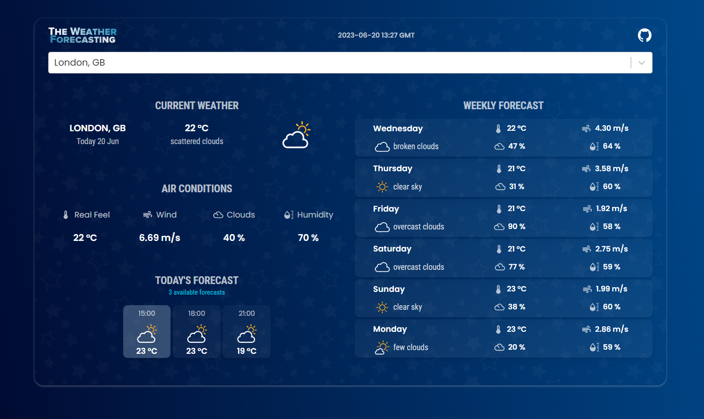

## ⛅ Weather App in ReactJS 


With [The Weather Forecasting](https://the-weather-forecasting.netlify.app) user can search locations by city name and observe the weather for the next 5-6 days and 3 hour interval.

The app is developed <b>Gunnidh Kaur</b> using React.js and deployed on kubernetes and Minikube. 



<br/>
<br/>


## ✨ Getting Started

- Make sure you already have `Node.js` and `npm` installed in your system.
- You need an API key from [OpenWeatherMap](https://openweathermap.org/). After creating an account, [grab your key](https://home.openweathermap.org/api_keys).
- Then, under the `src` directory, go to `api/OpenWeatherService` and replace `WEATHER_API_KEY` with your OpenWeatherMap API Key.
  - **`api/OpenWeatherService.js`**: It contains the code related to the back-end of the application.

<br/>

## ⚡ Install

- Install the packages using the command `npm install`

<br/>

## 📙 Used libraries

- `react-js`
- `material-ui`

Check `packages.json` for details

<br/>

# ☁️Dockerize Setup

Create Dockerfile in root directory `/the-weather-forecasting-main/`

```bash
# Use an official Node runtime as the base image
FROM node:16-alpine


# Set the working directory in the container
WORKDIR /app

# Copy package.json and package-lock.json to the working directory
COPY package*.json ./

# Install dependencies
RUN npm install

# Copy the rest of the react JS application code
COPY . .

# Build the React app
RUN npm run build

# Expose the port the app runs on
EXPOSE 3000

# Define the command to run your app
CMD ["npm", "start"]

```
### Explanation:
- `FROM node:16-alpine`: This line specifies the base image to use for the Docker container. In this case, it's an official Node.js runtime image with Alpine Linux as the base (a lightweight distribution).

- `WORKDIR /app`: This line sets the working directory inside the container where subsequent commands will be executed.

- `COPY package*.json ./`: This line copies the package.json and package-lock.json files from the host machine to the working directory in the container. This allows Docker to take advantage of Docker's layer caching mechanism to avoid re-installing dependencies if the package files haven't changed.

- `RUN npm install`: This command installs the Node.js dependencies defined in the package.json file into the container.

- `COPY . .`: This line copies the rest of the React.js application code from the host machine to the working directory in the container.

- `RUN npm run build`: This command builds the React app inside the container. It typically compiles the JavaScript code, bundles assets, and prepares the application for production deployment.

- `EXPOSE 3000`: This line exposes port 3000 on the container, allowing external connections to the application running inside the container.

- `CMD ["npm", "start"]`: This command defines the default command to run when the container starts. In this case, it runs the npm start command, which typically starts the Node.js server to serve the built React app.

<br/>
<br/>

# Kubernetes Development Setup

This guide provides instructions on setting up a Kubernetes development environment using Minikube and managing Docker containers and Kubernetes resources.

## Prerequisites

Before starting, ensure that you have the following installed on your system:
- [Minikube](https://minikube.sigs.k8s.io/docs/start/)
- [Docker Desktop](https://www.docker.com/products/docker-desktop/)
- [kubectl](https://kubernetes.io/docs/tasks/tools/install-kubectl/)

## Setup Instructions

### Step 1: Start Minikube
Start Docker desktop and open bash-shell in `/the-weather-forecasting-main/` and use the following command:
```bash
minikube start
```

This command initializes and starts Minikube, allowing you to run Kubernetes locally.

### Step 2: Configure Docker Environment

Now we will connect our bash-shell to the shell inside the Minikube so that whatever command of Minikube or Kubernetes we use will directly execute inside the Minikube. This command configures your local Docker environment to use the Docker daemon running inside the Minikube virtual machine.

```bash
eval $(minikube -p minikube docker-env)
```

### Step 3: Build Docker Image
Now we will build the docker image directly into the Minikube, to do this we use a command that builds a Docker image tagged with `local/gunnidh-kaur-bits-id-2022ab12539:v1` using the Dockerfile located in the current directory. Now since our bash-shell is connect to the shell inside Minikube, this docker image will build inside Minikube directly.

```bash
docker build -t local/gunnidh-kaur-bits-id-2022ab12539:v1 .
```


### Step 4: Create Kubernetes Manifest file 
Create a file `deployment.yaml` in directory `/the-weather-forecasting-main/deploy`. This document describes a Kubernetes Deployment manifest file named `deployment.yaml`, which defines the deployment of a containerized application.

```bash
apiVersion: apps/v1
kind: Deployment
metadata:
  name: gunnidh-kaur-weather-project
spec:
  replicas: 3
  selector:
    matchLabels:
      app: gunnidh_kaur_bits_id_2022ab12539
  template:
    metadata:
      labels:
        app: gunnidh_kaur_bits_id_2022ab12539
    spec:
      containers:
      - name: local-gunnidh-kaur-bits-id-2022ab12539
        image: local/gunnidh-kaur-bits-id-2022ab12539:v1
        imagePullPolicy: IfNotPresent
        ports:
        - containerPort: 3000

```
### Description

-   `apiVersion`: Specifies the Kubernetes API version being used.
-   `kind`: Specifies the kind of Kubernetes resource, which in this case is a Deployment.
-   `metadata`: Contains metadata about the deployment such as its name.
-   `spec`: Specifies the desired state of the deployment, including the number of replicas and the pod template.
    -   `replicas`: Defines the desired number of replicas for the deployment.
    -   `selector`: Specifies how the deployment identifies which pods are managed by it.
    -   `template`: Defines the pod template used for creating new pods.
        -   `metadata`: Contains labels that are applied to pods created from this template.
        -   `spec`: Defines the specification of the containers within the pod.
            -   `containers`: Specifies the containers within the pod.
                -   `name`: Specifies the name of the container.
                -   `image`: Specifies the Docker image to use for the container.
                -   `imagePullPolicy`: Specifies the image pull policy for the container.
                -   `ports`: Specifies the ports exposed by the container.

### Step 5: Apply Kubernetes Deployment

This command applies the Kubernetes deployment described in the `deployment.yaml` manifest file to your Kubernetes cluster, creating or updating the deployment.

```bash
kubectl apply -f deploy/deployment.yaml
```


### Step 6: Create Kubernetes Service
Create a file `service.yaml` in deploy directory. This document describes a Kubernetes Service manifest file named `service.yaml`, which defines a service to expose the `gunnidh-kaur-weather-project` deployment. The deployment file is used to create a deployment but we need this service file to create a service which will have load balancer to expose our cluster to the out side world.
```bash
apiVersion: v1
kind: Service
metadata:
  name: gunnidh-kaur-weather-project
  labels: 
    app: gunnidh_kaur_bits_id_2022ab12539
spec:
  type: LoadBalancer
  selector:
    app: gunnidh_kaur_bits_id_2022ab12539
  sessionAffinity: None
  ports:
    - name: http
      port: 3000
      protocol: TCP
      targetPort: 3000
```


### Step 7: Apply Kubernetes Service
This command applies the Kubernetes Service described in the `service.yaml` manifest file to your Kubernetes cluster, creating or updating the service.
```bash
kubectl apply -f deploy/service.yaml
```
The weather application is deployed as service in kubernetes cluster with Minikube.

<br/>
<br/>

## Verification

### Step 1: Verify Pods

```bash
kubectl get pods
```

This command lists all the pods currently running in your Kubernetes cluster, providing information about their names, statuses, and other relevant details.

##### Output


### Step 2: Verify Services

This command lists all the services currently running in your Kubernetes cluster, providing information about their names, types, IP addresses, and ports.

```bash
kubectl get service
```
##### Output


### Step 3: Verify Nodes

This command lists all the services currently running in your Kubernetes cluster, providing information about their names, types, IP addresses, and ports.

```bash
kubectl get nodes
```
##### Output


<br/>
<br/>

## Exposing Kubernetes Service with Minikube to outside world

Since we have deployed our application locally, Minikube has configure a load-balancer, with out assigning it public IP address. Due to this reason, when we send request to this service we have to create a virtual tunnel which will connect our system's local host to the cluster. This command demonstrates how to expose a Kubernetes service externally using Minikube. Specifically, it exposes the `gunnidh-kaur-weather-project` service.

### Command:

```bash
minikube service gunnidh-kaur-weather-project
```
#### Output: 


### Explanation:

- `minikube service`: This command allows you to access a Kubernetes service exposed within a Minikube cluster.
  
- `gunnidh-kaur-weather-project`: This is the name of the Kubernetes service that you want to expose.

### Purpose:

The purpose of this command is to provide a convenient way to access a Kubernetes service from outside the Minikube cluster during development or testing. By default, Minikube sets up a tunnel to the service and opens it in the default web browser or outputs the URL to the terminal.

### Note:

- This command is typically used in development or testing environments to quickly access services running inside a Minikube cluster without needing to set up complex networking configurations.

- The service must be exposed as a type that allows external access (e.g., in our case LoadBalancer) for this command to work as expected.

- This command is not intended for use in production environments, where services are typically exposed through more robust and controlled mechanisms, such as Load Balancers provided by cloud platforms or Ingress controllers in Kubernetes clusters.
