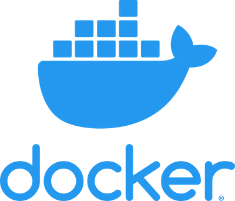
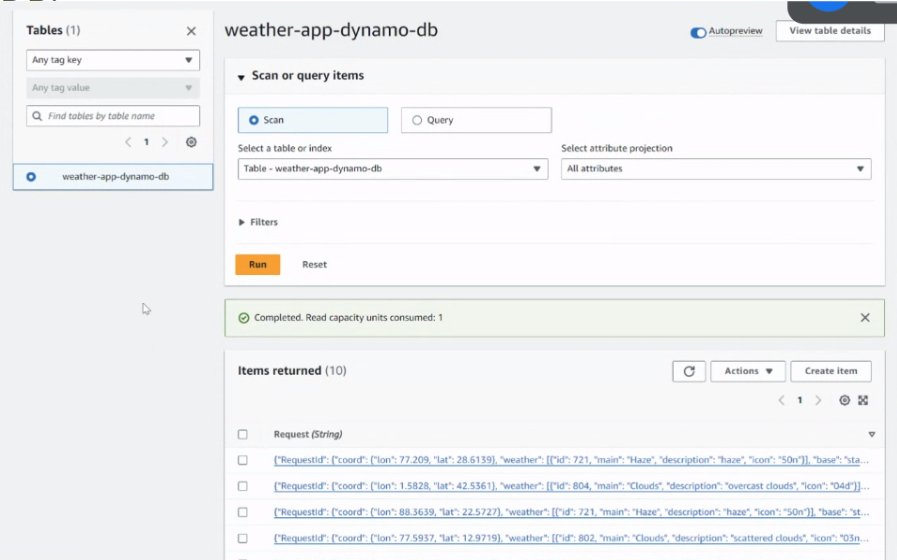
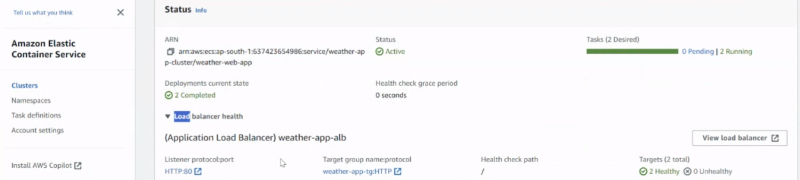
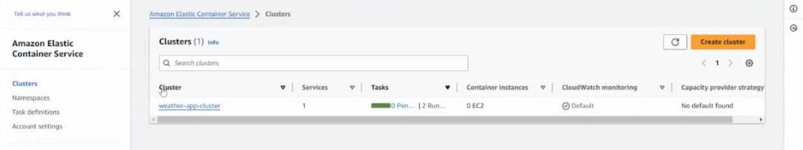

#  Report: Weather Forecasting App Deployment on AWS
##### Part-2 Submission by Group-10

##  Executive Summary

This report documents the development and deployment process of a weather forecasting application build and deployed by Group-10 by leveraging Amazon Web Services (AWS) cloud infrastructure. The application is designed to provide users with accurate weather forecasts while ensuring scalability, reliability, and security through seamless integration of various AWS services.

## Weather Forecasting App in ReactJS 

With The weather forecasting user can search locations by city name and observe the weather for the next 5-6 days and 3 hour interval.


<br/>


##  Source code

- You can find all the sourec code on this link [Github Link: the-weather-forecasting](https://github.com/gunnidh/the-weather-forecasting-main/). 

- We used Keys from `OpenWeatherMap` to get location details to use in the weather app. If you want to use the project, [grab your key by clicking on this link](https://home.openweathermap.org/api_keys).

- Then, under the `src` directory, go to `api/OpenWeatherService` and replace `WEATHER_API_KEY` with your OpenWeatherMap API Key.
  - **`api/OpenWeatherService.js`**: It contains the code related to the back-end of the application.

<br/>

## 📙 Used libraries

- `react-js`
- `material-ui`

<br/>

#  Docker Setup

Create Dockerfile in root directory `/the-weather-forecasting-main/`

```bash
# Use an official Node runtime as the base image
FROM node:16-alpine as build

# Set the working directory in the container
WORKDIR /app

# Copy package.json and package-lock.json to the working directory
COPY package*.json ./

# Install dependencies
RUN npm install

# Copy the rest of the react JS application code
COPY . .

# Build the React app
RUN npm run build

# Stage 2: Deploy with NGINX
FROM nginx:latest

# Copy built app from previous stage
COPY --from=build /app/build /usr/share/nginx/html

# Copy the Nginx configuration file
COPY --from=build /app/nginx/nginx.conf /etc/nginx/conf.d/default.conf

# Expose port 3000
EXPOSE 3000

# Start Nginx when the container starts
CMD ["nginx", "-g", "daemon off;"]

```
### Explanation:
This Dockerfile is used to build a Docker image for deploying a React.js application with Node.js and NGINX. Let's break it down step by step:

##### `FROM node:16-alpine as build`: 
This line specifies the base image to use for the first stage of the build process. It uses Node.js version 16 with the Alpine Linux distribution.

##### `WORKDIR /app`: 
Sets the working directory inside the container to `/app`.

##### `COPY package*.json ./`: 
Copies `package.json` and `package-lock.json` from the host into the `/app` directory in the container.

##### `RUN npm install`: 
Installs the dependencies specified in `package.json`.

##### `COPY . .`: 
Copies the entire content of the local directory (where the Dockerfile is located) into the `/app` directory in the container.

##### `RUN npm run build`: 
Builds the React app inside the container using the npm script defined in `package.json`.

##### `ROM nginx:latest`: 
Specifies the base image for the second stage of the build process, which is NGINX.

##### `COPY --from=build /app/build /usr/share/nginx/html`: 
Copies the built React app from the first stage (`build`) into the NGINX web server directory (`/usr/share/nginx/html`) in the second stage.

##### `COPY --from=build /app/nginx/nginx.conf /etc/nginx/conf.d/default.conf`: 
Copies the NGINX configuration file (`nginx.conf`) from the first stage (`build`) into the NGINX configuration directory in the second stage (`/etc/nginx/conf.d/default.conf`).

##### `EXPOSE 3000`: 
Exposes port 3000. However, note that this is typically used for development purposes, but in this Dockerfile, the application is served by NGINX, so this line might not be necessary.

##### `CMD ["nginx", "-g", "daemon off;"]`: 
Specifies the command to run when the container starts. It starts NGINX with the specified options (`-g "daemon off;"` runs NGINX in the foreground without daemonizing).

Overall, this Dockerfile sets up two stages: the first stage for building the React app with Node.js and the second stage for serving the built app with NGINX.

<br/>

#  Nginx Setup
Create nginx in root directory `/the-weather-forecasting-main/nginx` and create `nignx.conf` file. With the following content

```bash
server {
    listen 3000;
    server_name localhost;

    location / {
        root /usr/share/nginx/html;
        index index.html;
        try_files $uri $uri/ /index.html;
    }
}
```
### Explanation:

##### `listen 3000`:
This line specifies that NGINX should listen for incoming connections on port 3000.

##### `server_name localhost`: 
This line sets the server name for this NGINX configuration block. In this case, it's set to "localhost", meaning it will respond to requests targeting "localhost".

##### `location / { ... }`: 
This block defines how NGINX should handle requests that match the specified location ("/"). Within this block:

##### `root /usr/share/nginx/html`: 
This line sets the root directory from which NGINX will serve files for this location. In this case, it's set to "/usr/share/nginx/html".

##### `index index.html`: 
This line specifies the default file to serve if no specific file is requested. In this case, it's set to "index.html".

##### `try_files $uri $uri/ /index.html`: 
This line tells NGINX to attempt to serve the requested file ($uri), then the directory index uri, and if neither is found, serve "index.html". This is commonly used in single-page applications (SPAs) to handle client-side routing. This NGINX configuration block is typically used to serve a static website or a single-page application (SPA) where NGINX handles routing to the client-side application.

<br/>
<br/>

#  Deployment of the Weather Forecasting App to AWS

## Introduction

In today's digital age, the demand for accurate and accessible weather forecasts is more critical than ever. This section of report outlines the journey of deploying a weather forecasting application using AWS services to meet these demands effectively.

## AWS Services Utilized

The development and deployment of the weather forecasting application involved the following AWS services:

- **Amazon ECS (Elastic Container Service):** Used for orchestrating and managing containerized deployments of the weather forecasting app using AWS Fargate.

- **AWS Fargate:** Used for running the weather forecasting app as a containerized task on AWS in serverless fashion.

- **Amazon ECR (Elastic Container Registry):** Used for storing the container images for the weather forecasting app.

- **Amazon ECS Service:** Used for ensuring the desired number of tasks/nodes running in the ECS cluster for seamless application availability.

- **Application Load Balancer (ALB):** Used for facilitating HTTPS traffic routing to the ECS service, ensuring smooth user interactions across the globe.

- **AWS Lambda:** Handling user data from the React app and efficiently writing it to DynamoDB, ensuring data integrity and security.

- **Amazon DynamoDB:** Serving as the database for storing user data, ensuring seamless data handling and retrieval.

- **Amazon CloudWatch:** All services such as ECS, Fargate, and Lambda asynchronously log data into CloudWatch for monitoring and analysis purposes.

## Technical Details on Load Balancing and Auto Scaling

- **Minimum and Maximum Nodes:** The weather forecasting application is deployed with a minimum of 2 and a maximum of 4 nodes based on the rule of average CPU utilization of the Application Load Balancer. This dynamic scaling ensures optimal resource utilization and responsiveness of the application, scaling up or down based on demand.
  
- **ECS Cluster Configuration:** The ECS cluster is configured to automatically scale the number of nodes within the specified range based on the average CPU utilization of the ALB. This configuration ensures that the application can handle varying levels of traffic efficiently while minimizing costs during periods of low demand.

## Architecture Diagram


## Screenshots

#### `Dynamo DB`


</br>

#### `Lambda Function`


##### `Code in Lambda function`

{ : border="2em" }


</br>

#### `CloudWatch Logs`


</br>

#### `Application Load Balancer`


</br>

#### `ECS & Cluster`




</br>

#### `Task Definition: Nodes for weather forecasting app`


</br>

## Methodology

The weather forecasting app was developed using React for the frontend, supported by Nginx for web server configuration. The backend services were deployed using AWS Fargate, providing a serverless environment for enhanced scalability and cost efficiency.

The integration of AWS services, including ECS, ECR, ALB, DynamoDB, Lambda, and CloudWatch, ensured a robust and reliable infrastructure for the application. Continuous integration and deployment pipelines were set up to automate testing and deployment processes, ensuring the reliability and stability of the application throughout its lifecycle.

## Conclusion

In conclusion, the successful deployment of the weather forecasting application on AWS cloud infrastructure demonstrates the effectiveness of leveraging cloud services for building scalable, reliable, and secure applications. By harnessing the power of AWS services, we have created a solution that meets and exceeds the expectations of modern users seeking accurate and accessible weather forecasts.

## References

- AWS Documentation(https://docs.aws.amazon.com/)
